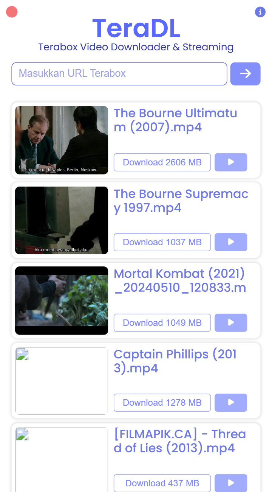
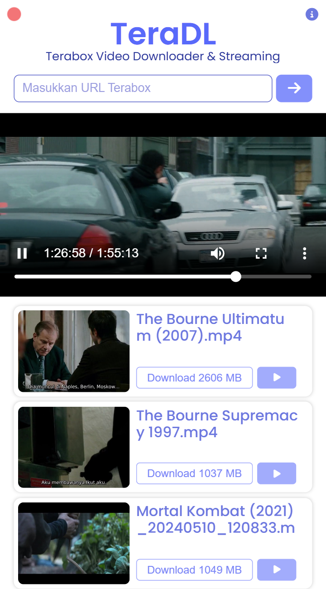
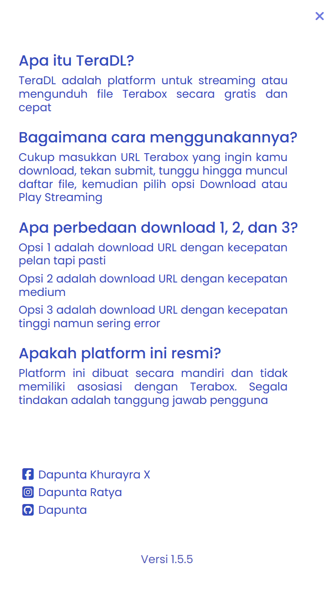

## TeraDL - Terabox File Downloader & Video Streaming

<b>TeraDL</b> is a platform for streaming videos or downloading Terabox files for free and quickly, so that users don't need to install Terabox application, but only by entering the URL, then the file is ready to be downloaded. <a href="/README.md">Indonesia Version</a>

 

    
    
    
    

### Information

<table style="border-collapse: collapse;">
    <tr>
        <td style="border: 1px solid transparent; line-height:1.3; padding: 0px;">Version</td>
        <td style="border: 1px solid transparent; line-height:1.3; padding: 0px;">1.5.5</td>
    </tr>
    <tr>
        <td style="border: 1px solid transparent; line-height:1.3; padding: 0px;">Website</td>
        <td style="border: 1px solid transparent; line-height:1.3; padding: 0px;"><a href="https://teradl.dapuntaratya.com">TeraDL</a></td>
    </tr>
    <tr>
        <td style="border: 1px solid transparent; line-height:1.3; padding: 0px;">API</td>
        <td style="border: 1px solid transparent; line-height:1.3; padding: 0px;"><a href="https://teradl-api.dapuntaratya.com">TeraDL API</a></td>
    </tr>
    <tr>
        <td style="border: 1px solid transparent; line-height:1.3; padding: 0px;">API Doc</td>
        <td style="border: 1px solid transparent; line-height:1.3; padding: 0px;"><a href="/api/README(EN).md">Documentation</a></td>
    </tr>
    <tr>
        <td style="border: 1px solid transparent; line-height:1.3; padding: 0px;">Author</td>
        <td style="border: 1px solid transparent; line-height:1.3; padding: 0px;"><a href="https://www.facebook.com/Dapunta.Khurayra.X">Dapunta Khurayra X</a></td>
    </tr>
    <tr>
        <td style="border: 1px solid transparent; line-height:1.3; padding: 0px;">Status</td>
        <td style="border: 1px solid transparent; line-height:1.3; padding: 0px;">Open Source (Full)</td>
    </tr>
</table>

### Screenshot

<table style="border-collapse: collapse; width: 100%; max-width: 800px; table-layout: fixed;">
    <tr>
        <td style="border: 1px solid transparent; padding: 5px; text-align: center;">
            
        </td>
        <td style="border: 1px solid transparent; padding: 5px; text-align: center;">
            
        </td>
        <td style="border: 1px solid transparent; padding: 5px; text-align: center;">
            
        </td>
    </tr>
</table>

### TechStack

<table style="border-collapse: collapse; width: 100%;">
    <tr>
        <td style="text-align: left; vertical-align: middle; padding: 8px;">
            <strong>Backend</strong>
        </td>
        <td style="vertical-align: middle; padding: 8px;">
            
            
        </td>
    </tr>
    <tr>
        <td style="text-align: left; vertical-align: middle; padding: 8px;">
            <strong>Frontend</strong>
        </td>
        <td style="vertical-align: middle; padding: 8px;">
            
            
            
        </td>
    </tr>
</table>

 

### Changelog

 

- **What's New In Version 1.5?**
    - Bug fixes can't download & stream
    - Using service from [`hnn`](https://terabox.hnn.workers.dev/) to get download url
    - Using `Terabox Proxy` for video streaming
    - New UI display

 

- **What's New In Version 1.4?**
    - Live video streaming feature
    - Support download various file formats
        - Video : `.mp4`, `.mov`, `.mkv`, `.m4v`, `.asf`, `.avi`, `.wmv`, `.m2ts`, `.3g2`
        - Image : `.jpg`, `.jpeg`, `.png`, `.gif`, `.webp`, `.svg`
        - Others : `.pdf`, `.docx`, `.zip`, `.rar`, `.7z`

 

- **What's New in Version 1.3?**
    - Added new mode *(`get link` with `cookies` from server side)* so that download URL is more durable, minimizes errors, and download process becomes faster
        - **Mode 1** : Using dynamic cookies obtained from scrap in real time
        - **Mode 2** : Using static cookies from admin (admin account login session)
    - Auto switch mode if `cookies` from server side is invalid

 

- **What's New in Version 1.2?**

    - [TeraDL](https://teradl.dapuntaratya.com/) is a continuation project of [TeraStream](https://terastream.dapuntaratya.com/)
    - Fixes `get file` which previously had error
    - Changes in programming logic for `get file` and `get link` so that loading process faster
    - Changes in appearance to be simpler and to make it look more attractive

 

### Notes

> [!TIP]  
> If you want to run locally, make sure `flask_app.py` is run  
> Then run *live-server* or *localhost* on `index.html`  

> [!WARNING]  
> This platform only works for links related to Terabox  
> Example: `1024terabox`, `freeterabox`, `nephobox`, and others  

> [!CAUTION]  
> Do not abuse, use it wisely !  
> All actions are the responsibility of the user  