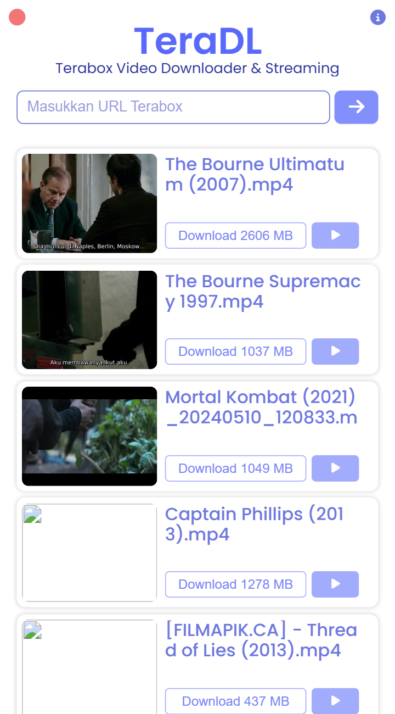
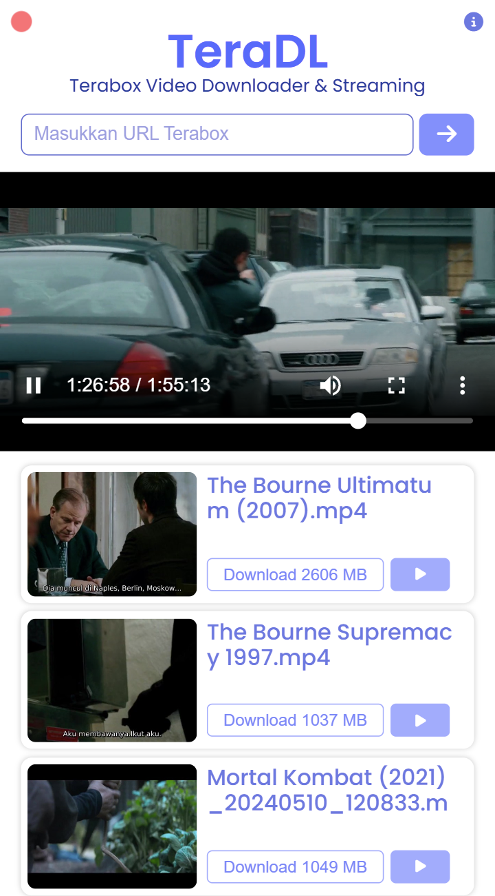
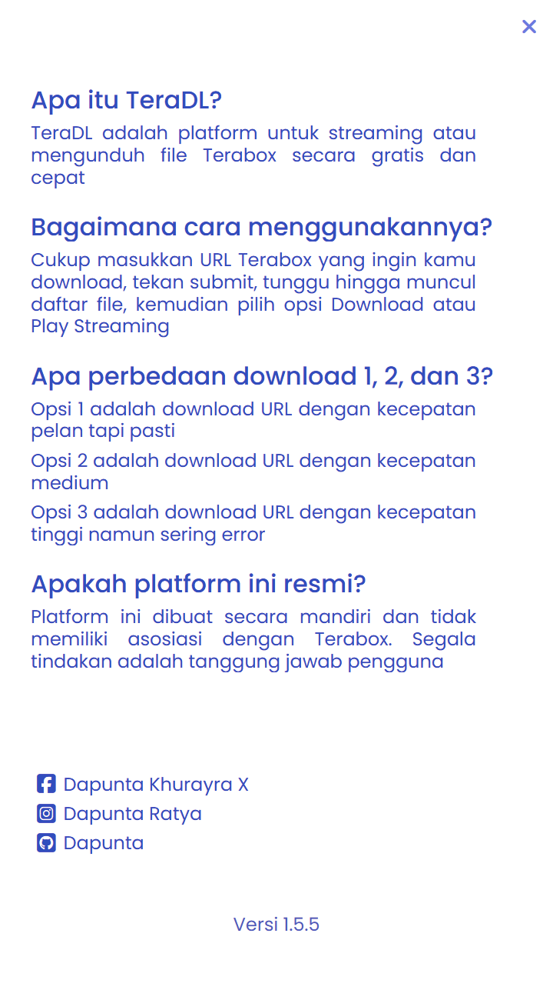

## TeraDL - Terabox File Downloader & Video Streaming

<b>TeraDL</b> adalah platform untuk streaming video atau mengunduh file Terabox secara gratis dan cepat, yang diciptakan agar pengguna tidak perlu menginstall aplikasi Terabox terlebih dahulu, tapi hanya dengan memasukkan url, kemudian file siap diunduh. <a href="/README(EN).md">English Version</a>

 

    
    
    
    

### Informasi

<table style="border-collapse: collapse;">
    <tr>
        <td style="border: 1px solid transparent; line-height:1.3; padding: 0px;">Version</td>
        <td style="border: 1px solid transparent; line-height:1.3; padding: 0px;">1.5.5</td>
    </tr>
    <tr>
        <td style="border: 1px solid transparent; line-height:1.3; padding: 0px;">Website</td>
        <td style="border: 1px solid transparent; line-height:1.3; padding: 0px;"><a href="https://teradl.dapuntaratya.com">TeraDL</a></td>
    </tr>
    <tr>
        <td style="border: 1px solid transparent; line-height:1.3; padding: 0px;">API</td>
        <td style="border: 1px solid transparent; line-height:1.3; padding: 0px;"><a href="https://teradl-api.dapuntaratya.com">TeraDL API</a></td>
    </tr>
    <tr>
        <td style="border: 1px solid transparent; line-height:1.3; padding: 0px;">API Doc</td>
        <td style="border: 1px solid transparent; line-height:1.3; padding: 0px;"><a href="/api/README.md">Documentation</a></td>
    </tr>
    <tr>
        <td style="border: 1px solid transparent; line-height:1.3; padding: 0px;">Author</td>
        <td style="border: 1px solid transparent; line-height:1.3; padding: 0px;"><a href="https://www.facebook.com/Dapunta.Khurayra.X">Dapunta Khurayra X</a></td>
    </tr>
    <tr>
        <td style="border: 1px solid transparent; line-height:1.3; padding: 0px;">Status</td>
        <td style="border: 1px solid transparent; line-height:1.3; padding: 0px;">Open Source (Full)</td>
    </tr>
</table>

### Screenshot

<table style="border-collapse: collapse; width: 100%; max-width: 800px; table-layout: fixed;">
    <tr>
        <td style="border: 1px solid transparent; padding: 5px; text-align: center;">
            
        </td>
        <td style="border: 1px solid transparent; padding: 5px; text-align: center;">
            
        </td>
        <td style="border: 1px solid transparent; padding: 5px; text-align: center;">
            
        </td>
    </tr>
</table>

### TechStack

<table style="border-collapse: collapse; width: 100%;">
    <tr>
        <td style="text-align: left; vertical-align: middle; padding: 8px;">
            <strong>Backend</strong>
        </td>
        <td style="vertical-align: middle; padding: 8px;">
            
            
        </td>
    </tr>
    <tr>
        <td style="text-align: left; vertical-align: middle; padding: 8px;">
            <strong>Frontend</strong>
        </td>
        <td style="vertical-align: middle; padding: 8px;">
            
            
            
        </td>
    </tr>
</table>

 

### Changelog

 

- **Apa Yang Baru Di Versi 1.5?**
    - Perbaikan bug tidak bisa download & streaming
    - Menggunakan service dari [`hnn`](https://terabox.hnn.workers.dev/) untuk mendapatkan url download
    - Menggunakan `Terabox Proxy` untuk streaming video
    - Tampilan UI baru

     

- **Apa Yang Baru Di Versi 1.4?**
    - Fitur streaming video secara langsung
    - Support download berbagai format file
        - Video : `.mp4`, `.mov`, `.mkv`, `.m4v`, `.asf`, `.avi`, `.wmv`, `.m2ts`, `.3g2`
        - Gambar : `.jpg`, `.jpeg`, `.png`, `.gif`, `.webp`, `.svg`
        - Lainnya : `.pdf`, `.docx`, `.zip`, `.rar`, `.7z`

     

- **Apa Yang Baru Di Versi 1.3?**
    - Penambahan mode baru *(`get link` dengan `cookies` dari sisi server)* sehingga URL download lebih awet, meminimalisir error, dan proses download menjadi lebih cepat
        - **Mode 1** : Menggunakan cookies dynamic yang didapat dari scrap secara real time
        - **Mode 2** : Menggunakan cookies static dari admin (sesi login akun admin)
    - Auto switch mode jika `cookies` dari sisi server invalid

     

- **Apa Yang Baru Di Versi 1.2?**

    - [TeraDL](https://teradl.dapuntaratya.com/) adalah project lanjutan dari [TeraStream](https://terastream.dapuntaratya.com/)
    - Perbaikan `get file` yang sebelumnya error
    - Perubahan logika pemrograman untuk `get file` dan `get link` sehingga proses loading lebih cepat
    - Perubahan tampilan menjadi lebih sederhana dan agar terkesan lebih menarik

 

### Catatan

> [!TIP]  
> Jika ingin menjalankan di local, pastikan `flask_app.py` sudah di-run  
> Lalu jalankan *live-server* atau *localhost* pada `index.html`

> [!WARNING]  
> Platform ini hanya berfungsi untuk link yang berkaitan dengan Terabox  
> Contoh : `1024terabox`, `freeterabox`, `nephobox`, dan lainnya

> [!CAUTION]  
> Jangan abuse, gunakan sewajarnya !  
> Segala tindakan adalah tanggung jawab pengguna  